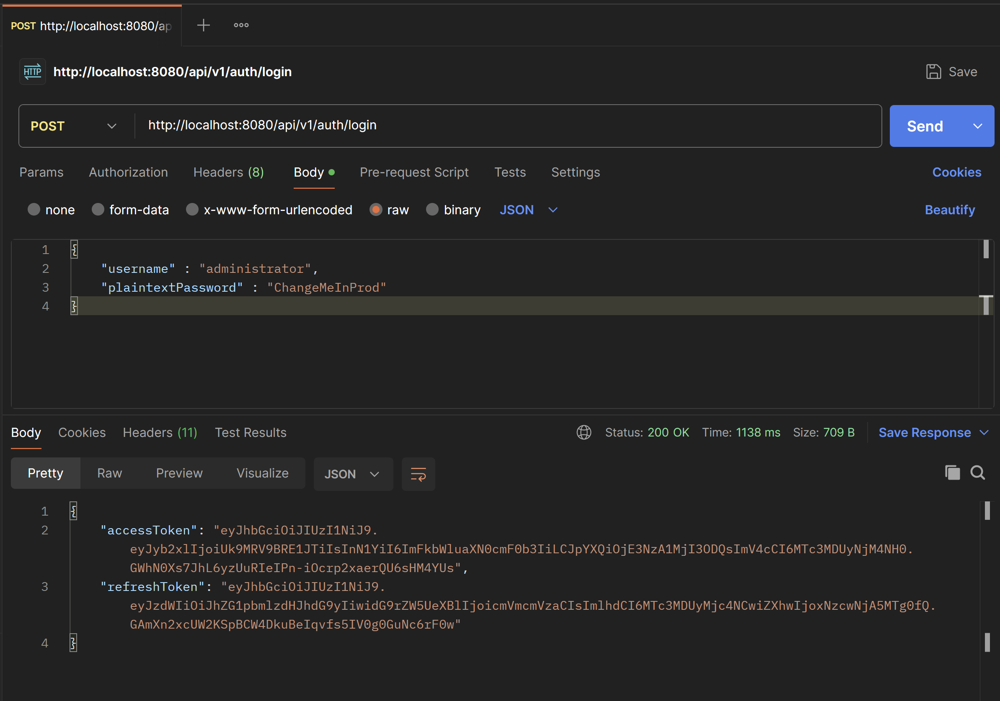
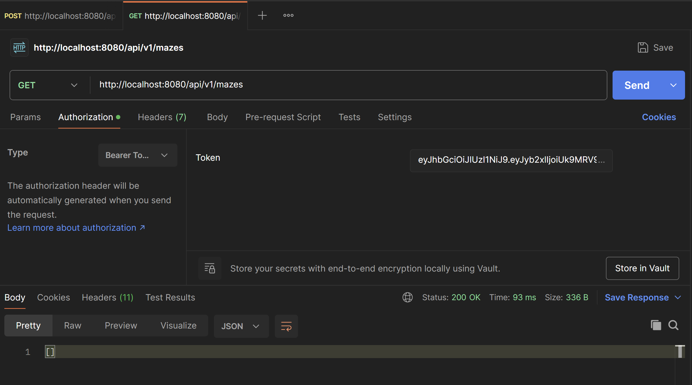
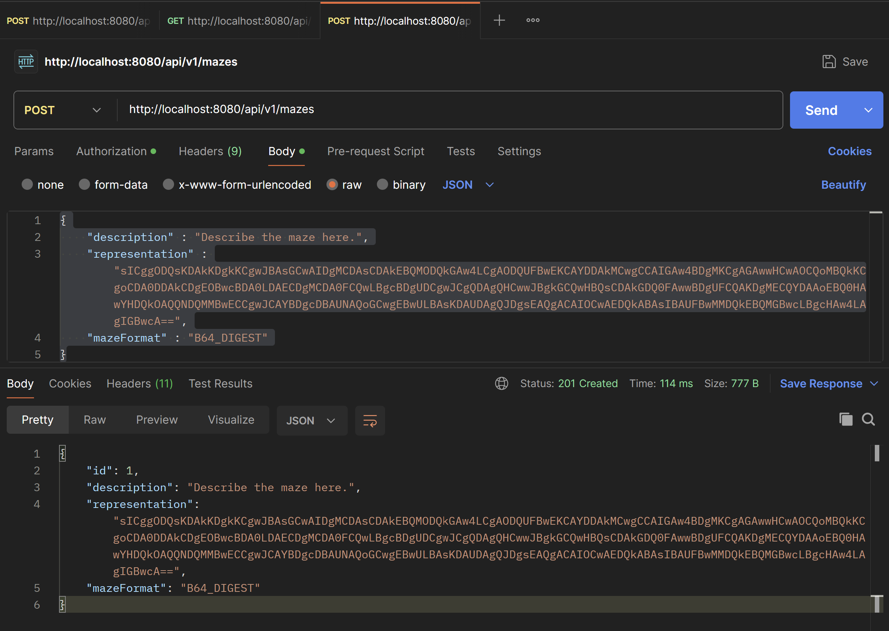
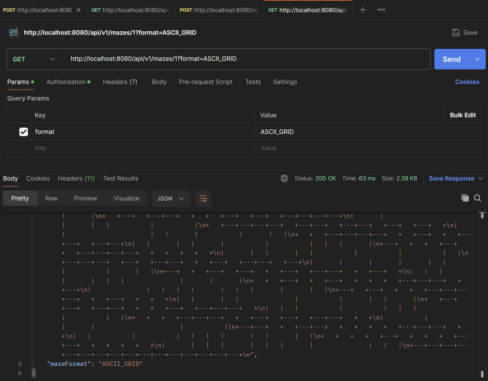

# Micromouse Labs

Micromouse Labs is a project to make it easy for users to retrieve and upload IEEE Micromouse competition mazes. This makes it easier to get both historical and algorithmically-generated mazes to test your Micromouse robot or its solver algorithms against. 

Currently, this application takes the form of a SpringBoot REST API and allows for uploading and retrieving Micromouse mazes in a variety of formats. 

## Managing the Spring Boot Application with Maven

This application uses Maven. To clean your environment, run tests, and compile the project you can `cd ./mazes` and then `./mvnw clean package`. If you just want to build the package you can `./mvnw clean package -DskipTests`. 

When running the application locally, you can use `./mvnw spring-boot:run`. If development profile is not being loaded automatically (meaning the admin account is not coming pre-provisioned) you can use `./mvnw spring-boot:run -Dspring-boot.run.profiles=dev` instead to ensure the dev profile us being used by Maven. 

To deploy is production, you can run the Jar file once it has been compiled: `java -jar target/<jar-file-name>.jar`.

> ![CAUTION] Do not deploy the application in either test or dev profiles in production. Always use a proper production profile with environment variables when deploying to a real server instance that others can access.

## Maze Formats

You can add mazes in a variety of formats. Mazes can be encoded as ASCII, a Base64 digest, or a Hex encoding. 

For example, the following Micromouse maze represented in ASCII art:
```
+---+---+---+---+---+---+---+---+---+---+---+---+---+---+---+---+
|                   |   |           |           |               |
+---+   +---+   +---+   +---+---+   +   +---+---+   +---+---+   +
|       |       |               |           |           |       |
+   +   +---+---+---+   +   +---+---+---+   +---+---+   +   +   +
|   |       |   |       |       |               |   |   |   |   |
+   +---+---+   +   +---+---+---+---+---+   +---+   +   +   +---+
|               |       |       |                       |       |
+   +---+   +---+---+   +   +   +---+   +---+   +---+---+---+---+
|       |                   |       |   |           |           |
+   +---+---+---+---+   +---+---+   +---+---+   +---+   +---+   +
|   |                       |   |       |           |       |   |
+   +   +---+---+---+---+   +   +---+   +   +---+---+   +---+---+
|   |       |   |       |           |           |   |   |       |
+---+   +   +   +---+   +   +---+---+---+---+   +   +   +   +   +
|       |   |       |   |           |           |           |   |
+---+---+---+   +---+   +---+---+   +   +---+   +---+---+   +---+
|       |       |       |       |   |   |           |       |   |
+---+   +   +---+   +---+   +   +---+   +---+---+   +   +---+   +
|   |   |       |       |   |   |               |       |       |
+   +   +---+   +   +---+   +   +   +   +---+---+---+   +   +---+
|               |   |   |   |       |   |   |       |       |   |
+---+   +---+   +   +   +---+---+---+---+   +   +---+   +   +   +
|   |       |   |               |           |       |   |       |
+   +---+   +---+   +---+---+   +   +   +---+   +---+---+---+   +
|   |   |           |           |   |   |       |           |   |
+   +   +   +---+---+---+   +   +---+   +---+   +---+---+   +   +
|           |       |       |                       |           |
+---+---+   +   +---+---+   +   +   +   +   +---+---+---+   +   +
|   |           |           |   |   |   |       |   |       |   |
+   +   +   +   +---+   +   +   +   +---+---+   +   +   +   +   +
|       |   |   |       |   |   |       |               |   |   |
+---+---+---+---+---+---+---+---+---+---+---+---+---+---+---+---+
```

would be encoded as the following Hexadecimal digest: 
```
B080A080E0D0B0A0C090A0E090A0A0C09040B060B00080E03020C0B020C090405030E0D0906030E0B0A000E0D050507010A0806030C090C0B0802080206030E010E030A0A0006030C070B000E090A0C05090A0A0A020C0D030C09020E010E0707010C0D0B0C01020E03020C0D05090C0B0607010E05030A0C090A04030204070B0C09060906090C07050B020C09060D0D05030C010E050509000A0E0304090603000A04050D070306070D090E01040D0D030C0701020A0C090806010E070304050D010A060B080407050B040B0A0C05030204090E0B0401080008020E0B00040D0900040B0804050507030C0D090405030607070B060707030E0B02020607070
```

where each cell if the Maze is encoded to a bitmap that 
```c
u8 cell_representation =    
    (0b10000000 & north_wall_present) |
    (0b01000000 & east_wall_present) |
    (0b00100000 & south_wall_present) |
    (0b00010000 & west_wall_present);
```

where the most significant nibble is used to store the wall locations and the least significant nibble is reserved for the time being.

To make this even more space efficient, the Hexadecimal digest can be converted directly into binary and base64 encoded: `"sICggODQsKDAkKDgkKCgwJBAsGCwAIDgMCDAsCDAkEBQMODQkGAw4LCgAODQUFBwEKCAYDDAkMCwgCCAIGAw4BDgMKCgAGAwwHCwAOCQoMBQkKCgoCDA0DDAkCDgEOBwcBDA0LDAECDgMCDA0FCQwLBgcBDgUDCgwJCgQDAgQHCwwJBgkGCQwHBQsCDAkGDQ0FAwwBDgUFCQAKDgMECQYDAAoEBQ0HAwYHDQkOAQQNDQMMBwECCgwJCAYBDgcDBAUNAQoGCwgEBwULBAsKDAUDAgQJDgsEAQgACAIOCwAEDQkABAsIBAUFBwMMDQkEBQMGBwcLBgcHAw4LAgIGBwcA=="`. This is how the mazes are stored in the database. 


## Usage

### Authenticating

A development profile has been established that allows for easy local development and testing. This profile comes pre-loaded with an admin account. This is the account you can use to get started. 

To login and get an access token for the default admin user, you can send a POST request to `http://localhost:8080/api/v1/auth/login` with the following JSON payload:
```
{
    "username" : "administrator",
    "plaintextPassword" : "ChangeMeInProd"
}
```

This can be done using the following curl command:
```sh
curl -v -X POST http://localhost:8080/api/v1/auth/login \
  -H "Content-Type: application/json" \
  -d '{
    "username": "administrator",
    "plaintextPassword": "ChangeMeInProd"
  }'
```

Or you can use Postman:


> ![CAUTION] The dev profile uses a default admin account with insecure credentials. Never deploy this application in the dev profile. 

This should give you an access token labelled `"accessToken"`. Copy and paste this value. 

### Viewing All Mazes

You can now view all the mazes. Send a GET request to `http://localhost:8080/api/v1/mazes` with the access token you had before included in your Authorization header. 

This can be done using the following curl command:
```sh
curl -X GET http://localhost:8080/api/v1/mazes \
  -H "Authorization: Bearer YOUR_JWT_HERE"
```

Or you can use Postman:


### Adding Mazes

A maze can be added by sending a POST request to `http://localhost:8080/api/v1/mazes` with the following JSON payload (keeping the JWT Authorization that was previously created):
```
{
    "description" : "Describe the maze here.",
    "representation" : <the-representation>,
    "mazeFormat" : <the-format-of-the-maze-representation> // one of "B64_DIGEST", "HEX_DIGEST", or "ASCII_GRID"
}
```

For example, the curl request would look like:
```sh
curl -X POST http://localhost:8080/api/v1/mazes \
  -H "Authorization: Bearer YOUR_JWT_HERE" \
  -H "Content-Type: application/json" \
  -d '{
    "description": "Describe the maze here.",
    "representation": "sICggODQsKDAkKDgkKCgwJBAsGCwAIDgMCDAsCDAkEBQMODQkGAw4LCgAODQUFBwEKCAYDDAkMCwgCCAIGAw4BDgMKCgAGAwwHCwAOCQoMBQkKCgoCDA0DDAkCDgEOBwcBDA0LDAECDgMCDA0FCQwLBgcBDgUDCgwJCgQDAgQHCwwJBgkGCQwHBQsCDAkGDQ0FAwwBDgUFCQAKDgMECQYDAAoEBQ0HAwYHDQkOAQQNDQMMBwECCgwJCAYBDgcDBAUNAQoGCwgEBwULBAsKDAUDAgQJDgsEAQgACAIOCwAEDQkABAsIBAUFBwMMDQkEBQMGBwcLBgcHAw4LAgIGBwcA==",
    "mazeFormat": "B64_DIGEST"
  }'
```

and making the request in Postman would look like:



### Viewing a Specific Maze

The API allows for viewing a specific maze in the format of your choosing by specifying the format as the query parameter. For example, sending a GET request to `http://localhost:8080/api/v1/mazes/1?format=ASCII_GRID` for the previously submitted maze would yield:
```json
{
    "id": 1,
    "description": "Describe the maze here.",
    "representation": "+---+---+---+---+---+---+---+---+---+---+---+---+---+---+---+---+\n|                   |   |           |           |               |\n+---+   +---+   +---+   +---+---+   +   +---+---+   +---+---+   +\n|       |       |               |           |           |       |\n+   +   +---+---+---+   +   +---+---+---+   +---+---+   +   +   +\n|   |       |   |       |       |               |   |   |   |   |\n+   +---+---+   +   +---+---+---+---+---+   +---+   +   +   +---+\n|               |       |       |                       |       |\n+   +---+   +---+---+   +   +   +---+   +---+   +---+---+---+---+\n|       |                   |       |   |           |           |\n+   +---+---+---+---+   +---+---+   +---+---+   +---+   +---+   +\n|   |                       |   |       |           |       |   |\n+   +   +---+---+---+---+   +   +---+   +   +---+---+   +---+---+\n|   |       |   |       |           |           |   |   |       |\n+---+   +   +   +---+   +   +---+---+---+---+   +   +   +   +   +\n|       |   |       |   |           |           |           |   |\n+---+---+---+   +---+   +---+---+   +   +---+   +---+---+   +---+\n|       |       |       |       |   |   |           |       |   |\n+---+   +   +---+   +---+   +   +---+   +---+---+   +   +---+   +\n|   |   |       |       |   |   |               |       |       |\n+   +   +---+   +   +---+   +   +   +   +---+---+---+   +   +---+\n|               |   |   |   |       |   |   |       |       |   |\n+---+   +---+   +   +   +---+---+---+---+   +   +---+   +   +   +\n|   |       |   |               |           |       |   |       |\n+   +---+   +---+   +---+---+   +   +   +---+   +---+---+---+   +\n|   |   |           |           |   |   |       |           |   |\n+   +   +   +---+---+---+   +   +---+   +---+   +---+---+   +   +\n|           |       |       |                       |           |\n+---+---+   +   +---+---+   +   +   +   +   +---+---+---+   +   +\n|   |           |           |   |   |   |       |   |       |   |\n+   +   +   +   +---+   +   +   +   +---+---+   +   +   +   +   +\n|       |   |   |       |   |   |       |               |   |   |\n+---+---+---+---+---+---+---+---+---+---+---+---+---+---+---+---+\n",
    "mazeFormat": "ASCII_GRID"
}
```

The curl command would look like:
```sh
curl -X GET "http://localhost:8080/api/v1/mazes/1?format=ASCII_GRID" \
  -H "Authorization: Bearer YOUR_JWT_HERE"
```

and using Postman would look like:



## Features to Come

- A frontend to make the application more user-friendly
- An enhanced checker to validate that mazes conform to the IEEE event standards more strictly
- Maze generation algos
- Tools for simulating solving algos
- Containerization with Podman Quadlets
- An improved authentication and authorization scheme
- Users can make Mazes they upload private, and share them with others
- Deploying the application publicly to a domain
- Support for Half-Size mazes
- A dedicated .micromaze file format
- A library of mazes used at historical Micromouse competitions
